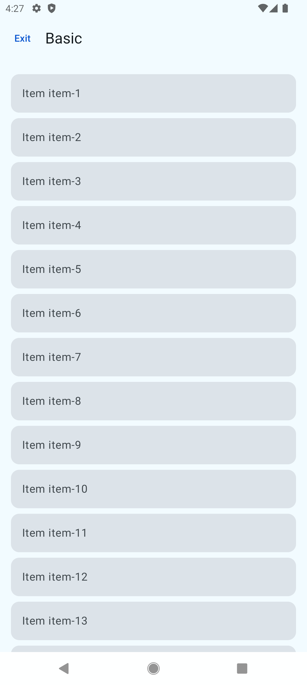
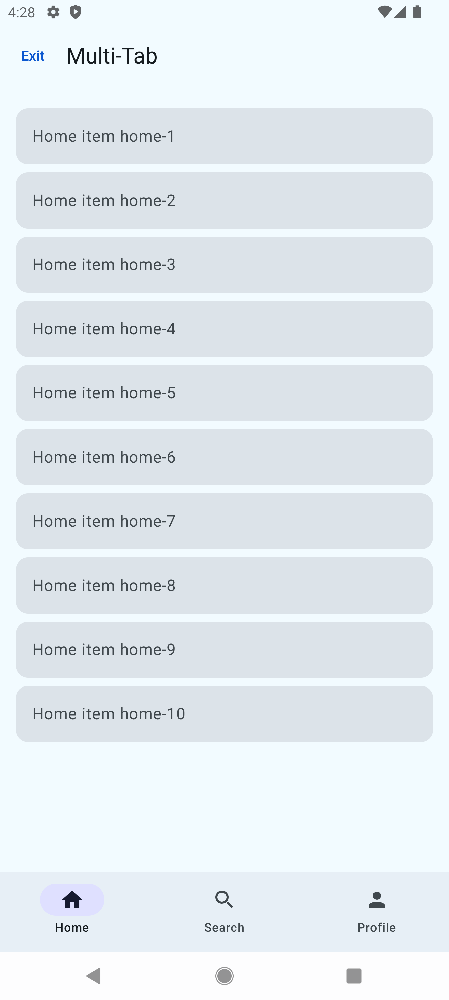
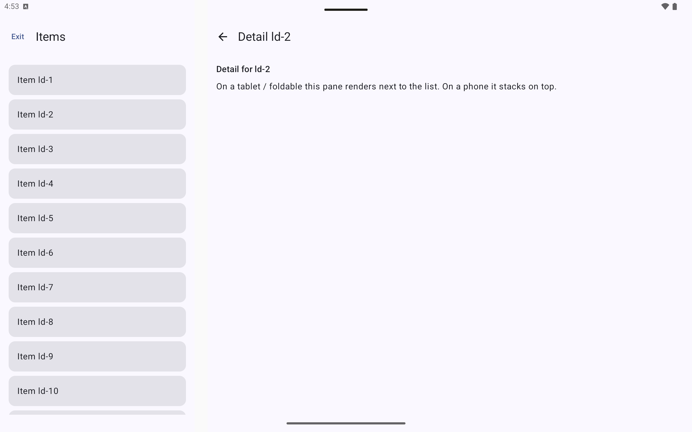

# nav3-cookbook


> Fixes the problem where AI tools generate Nav2 code instead of Nav3.

| Basic | Multi-Tab | List-Detail |
|-------|-----------|-------------|
|  |  |  |

## The Problem

Ask any AI to "build tab navigation" and it generates this:

```kotlin
// ❌ What AI generates (Nav2)
val navController = rememberNavController()
NavHost(navController, startDestination = HomeRoute) {
    composable<HomeRoute> { HomeScreen() }
}
```

Nav3 is fundamentally different. There's no NavController. The back stack is just a list you own.

```kotlin
// ✅ What it should generate (Nav3)
val backStack = rememberNavBackStack(HomeKey)
NavDisplay(
    backStack = backStack,
    onBack = { backStack.removeLastOrNull() },
    entryProvider = entryProvider {
        entry<HomeKey> { HomeScreen() }
    }
)
```

This repo fixes that.

## What's Inside

### 1. Runnable Sample App

Three screens that demonstrate the most common Nav3 patterns:

| Screen | Patterns Covered |
|--------|-----------------|
| `basic/` | NavKey + entryProvider + `dropUnlessResumed` (double-tap prevention) |
| `multitab/` | BottomNavigationBar + per-tab back stack + `NavigationState` |
| `listdetail/` | Material3 `ListDetailSceneStrategy` + adaptive layout |

Built with Nav3 1.1.0, compileSdk 36, Kotlin 2.0+.

### 2. Claude Code Plugin

A skill package that teaches Claude the correct Nav3 patterns.

| Skill | Purpose |
|-------|---------|
| `nav3-orchestrator` | Routes your request to the right agent/skill |
| `nav3-setup` | Gradle deps + `compileSdk 36` + version catalog |
| `nav3-backstack` | Core patterns + multi-stack + deep links + result passing |
| `nav3-scenes` | Dialog, BottomSheet, ListDetail, TwoPane, animations |
| `nav3-patterns` | Modularization (Hilt/Koin), Nav2→Nav3 migration |
| `nav3-review` | Code review: 10 anti-patterns, Critical/High/Medium checklist |

## Install the Plugin

```
/plugin install nav3@nav3-marketplace
```

Then ask Claude anything Nav3-related:

```
"Nav3로 탭 네비게이션 만들어줘"
"Nav2 → Nav3 마이그레이션 도와줘"
"내 Nav3 코드 리뷰해줘"
"Dialog를 BottomSheet로 바꿔줘"
```

## Build the Sample App

**Requirements:** Android Studio Meerkat+, Java 17+

```bash
git clone https://github.com/manjees/nav3-cookbook.git
cd nav3-cookbook
./gradlew :app:installDebug
```

> **Note:** Nav3 `lifecycle-viewmodel-navigation3` and `adaptive-navigation3` are still in alpha.
> The version badge at the top of this README reflects the tested version.
> API may change — check [CHANGELOG.md](CHANGELOG.md) for updates.

## Key Patterns

### Always use `dropUnlessResumed`

```kotlin
// ❌ Bug: rapid taps navigate twice
Button(onClick = { backStack.add(DetailKey("123")) })

// ✅ Fix: drops the event if screen is not resumed
Button(onClick = dropUnlessResumed { backStack.add(DetailKey("123")) })
```

### `rememberSaveableStateHolderNavEntryDecorator` must be first

```kotlin
NavDisplay(
    entryDecorators = listOf(
        rememberSaveableStateHolderNavEntryDecorator(), // ← MUST be first
        rememberViewModelStoreNavEntryDecorator()
    ),
    ...
)
```

### Dialog/BottomSheet must implement `OverlayScene`

```kotlin
// ❌ Bug: SceneDecoratorStrategy wraps dialog with app bar
class MyDialogScene<T : Any>(...) : Scene<T>

// ✅ Fix: skips decorator chain
class MyDialogScene<T : Any>(...) : OverlayScene<T>
```

## Questions & Feedback

→ [Ask in Discussions](https://github.com/manjees/nav3-cookbook/discussions)
→ [File a Bug or Feature Request](https://github.com/manjees/nav3-cookbook/issues)

## Built By

Android Tech Lead (7+ yrs). Previously built multi-model agent pipelines and Compose libraries.

Contributions welcome — especially for patterns not yet covered (SupportingPane, shared element transitions, deep link handling).

## License

Apache 2.0 — see [LICENSE](LICENSE)
